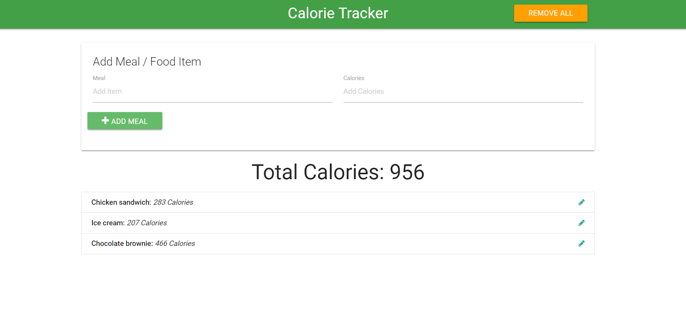
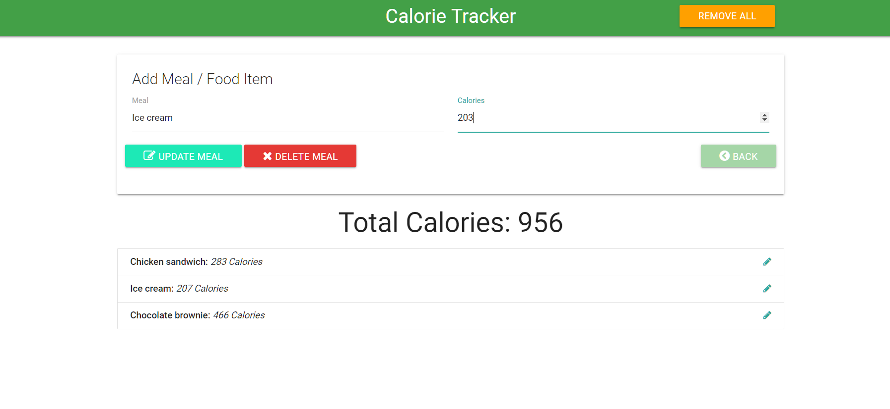

This is a Calorie Tracker App built with Vanilla Javascript using the module Pattern approach. This app have a CRUD functionality and data is persisted to local storage. 
UI of this app is done with Materlize CSS.

To run the project click here, https://shoaibjalal.github.io/CalorieTracker/.

